# Markdown Preview Sample

This file contains neutral Markdown examples.

## Heading Levels

# Heading Level 1

## Heading Level 2

### Heading Level 3

#### Heading Level 4

##### Heading Level 5

###### Heading Level 6

## Paragraphs and Inline Styles

This paragraph contains **bold text**, _italic text_, **_bold italic text_**, ~~strikethrough text~~, and `inline code`.
It also includes HTML entities such as Fish &amp; Chips, tea &lt; coffee, and escaped characters like \*asterisks\* and \_underscores\_.

This line ends with a hard break.  
This line appears directly below it.

This line ends with a backslash\
and continues on the next line.

## Links and Images

[Inline link](https://example.com)

[Link with title](https://example.com/title "Example Title")

[Reference link][reference]

<https://example.com/help>

https://example.com/status?view=full


## Blockquotes

> Blockquote line 1
> Blockquote line 2
>
> > Nested blockquote line 1
> > Nested blockquote line 2
>
> - Blockquote list item 1
> - Blockquote list item 2

## Lists

### Unordered List

- Item 1
- Item 2
  - Nested item 2.1
  - Nested item 2.2
    - Nested item 2.2.1
- Item 3
  continuation line

### Ordered List

1. Item 1
2. Item 2
   1. Nested item 2.1
   2. Nested item 2.2
3. Item 3

1) Alternate marker 1
2) Alternate marker 2

### Task List

- [x] Completed task
- [ ] Incomplete task
  - [x] Nested completed task
  - [ ] Nested incomplete task

1. [x] Ordered completed task
2. [ ] Ordered incomplete task

- List item with blockquote child
  > Nested blockquote inside a list item
- List item with code fence child
  ```bash
  printf 'sample\n'
  ```

## Tables

| Column  | Center |       Right |
| :------ | :----: | ----------: |
| Value A |   1    |       alpha |
| Value B |   2    |        beta |
| 日本語  |   3    | mixed ASCII |

## Code Fences

```zig
const std = @import("std");

fn sum(values: []const i32) i32 {
    var total: i32 = 0;
    for (values) |value| total += value;
    return total;
}

pub fn main() void {
    const values = [_]i32{ 1, 2, 3, 4 };
    std.debug.print("sum={}\n", .{sum(&values)});
}
```

```c
#include <stdio.h>

static int sum(const int *values, int len) {
    int total = 0;
    for (int i = 0; i < len; ++i) {
        total += values[i];
    }
    return total;
}

int main(void) {
    int values[] = {1, 2, 3, 4};
    printf("sum=%d\n", sum(values, 4));
    return 0;
}
```

```rust
fn sum(values: &[i32]) -> i32 {
    values.iter().copied().sum()
}

fn main() {
    let values = [1, 2, 3, 4];
    println!("sum={}", sum(&values));
}
```

```go
package main

import "fmt"

func sum(values []int) int {
	total := 0
	for _, value := range values {
		total += value
	}
	return total
}

func main() {
	values := []int{1, 2, 3, 4}
	fmt.Printf("sum=%d\n", sum(values))
}
```

```json
{
  "name": "example",
  "enabled": true,
  "items": [
    { "id": 1, "label": "alpha" },
    { "id": 2, "label": "beta" }
  ],
  "meta": {
    "count": 2,
    "tag": "sample"
  }
}
```

```bash
set -eu

input="sample.md"

if [ -f "$input" ]; then
  mp "$input"
else
  printf 'missing: %s\n' "$input"
fi
```

```
Plain text fence
Line 2 with symbols like | and *.
Line 3 with indentation:
    plain text stays as-is.
```

## Mermaid Diagrams

The following Mermaid diagrams are rendered as ASCII art in place.

### Flowchart

#### Basic TD direction

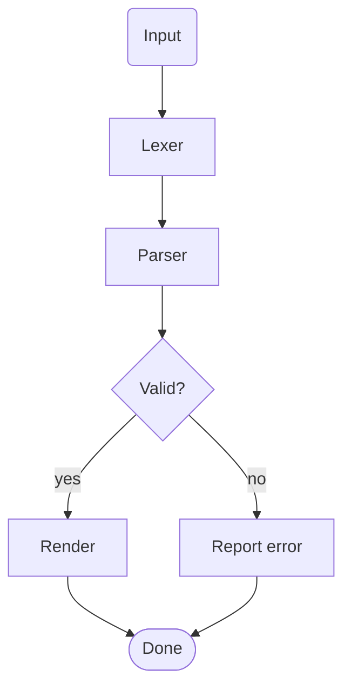

#### Basic LR direction

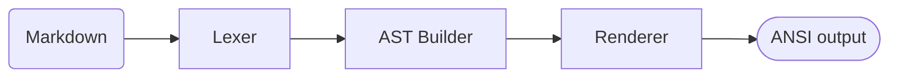

#### Nested subgraph

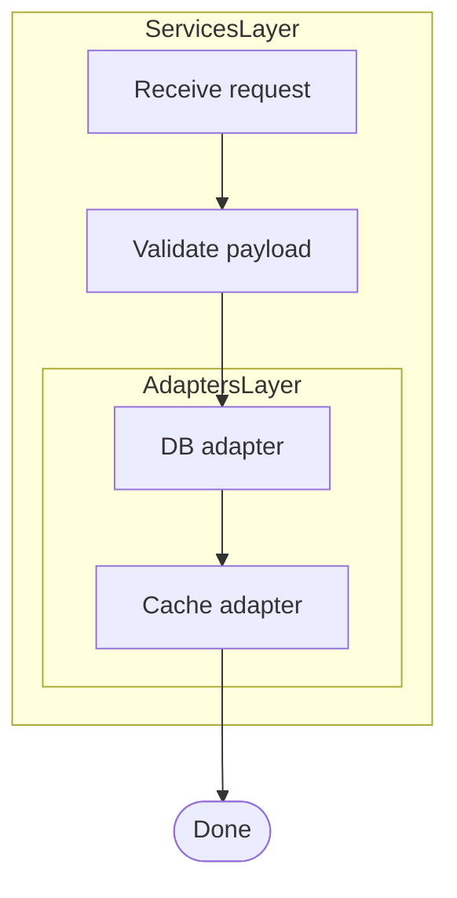

### Sequence diagram

#### Basic

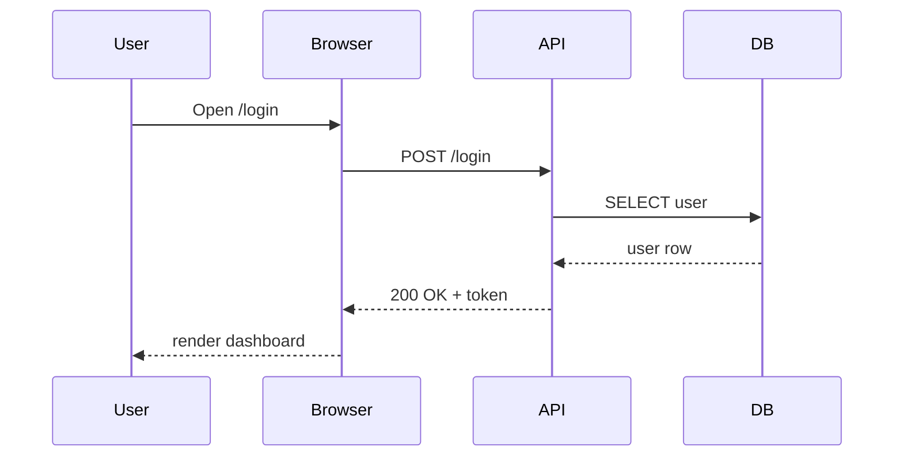

#### With `alt` / `else` / `par` and a note

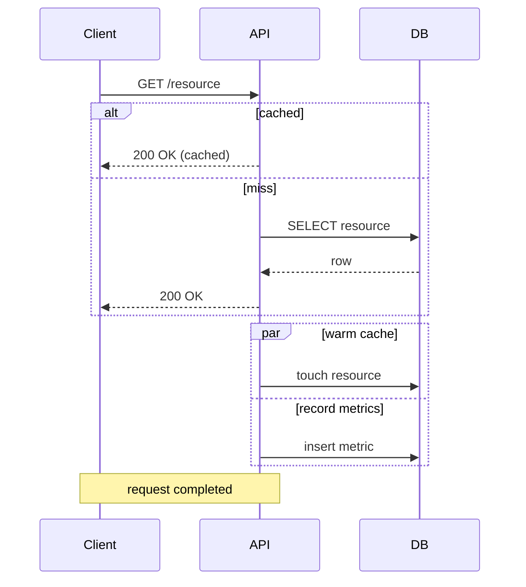

### Class diagram

#### Basic

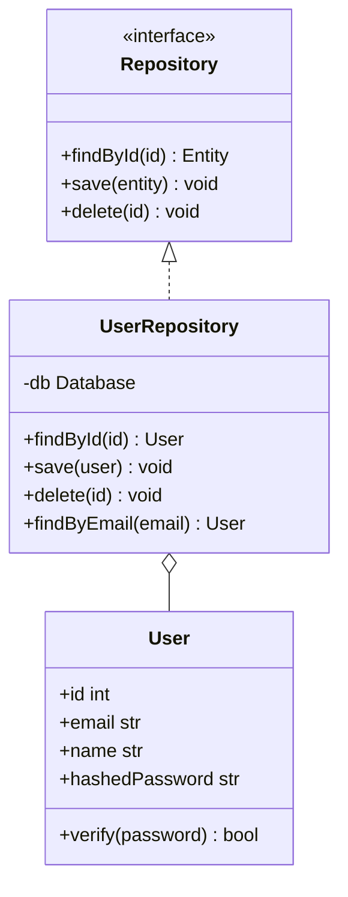

#### With namespace, annotation, and static/abstract members

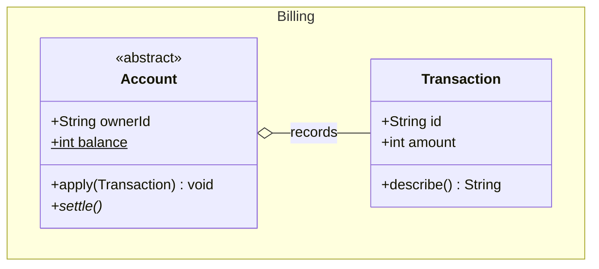

### State diagram

#### Basic

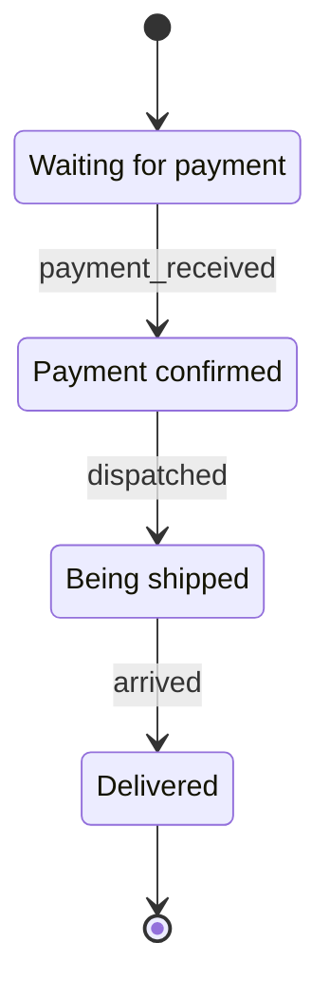

#### Composite state

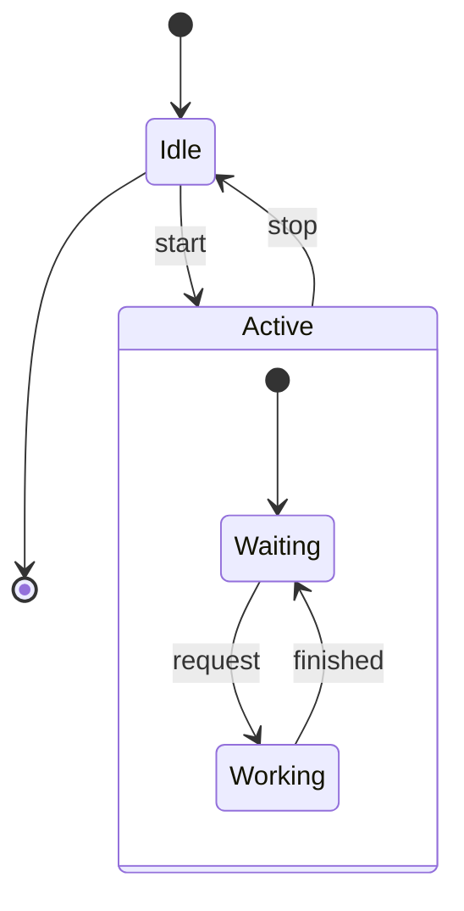

### ER diagram

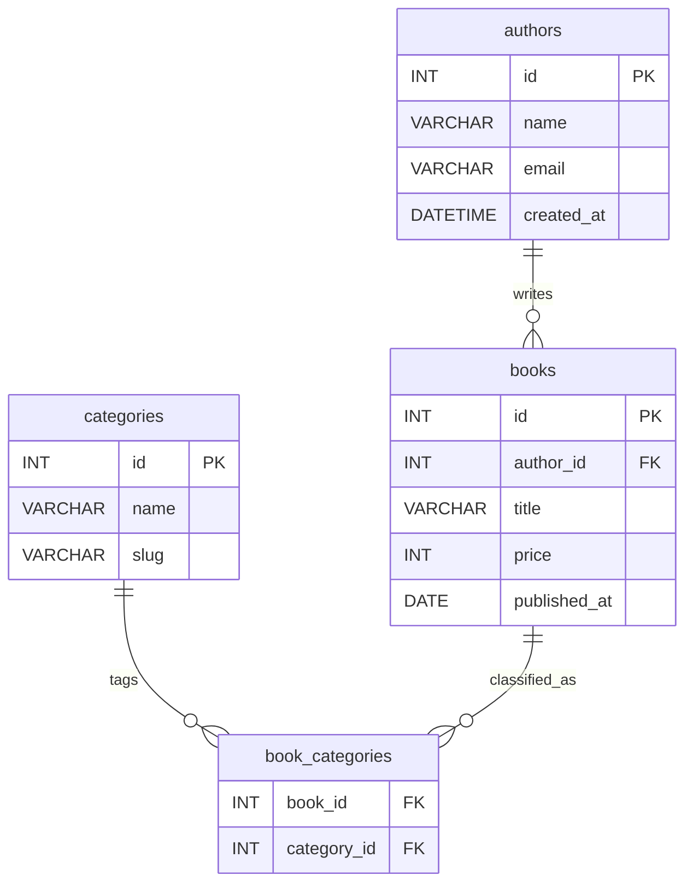

### gitGraph

When the terminal supports color, each branch is rendered in its own color.

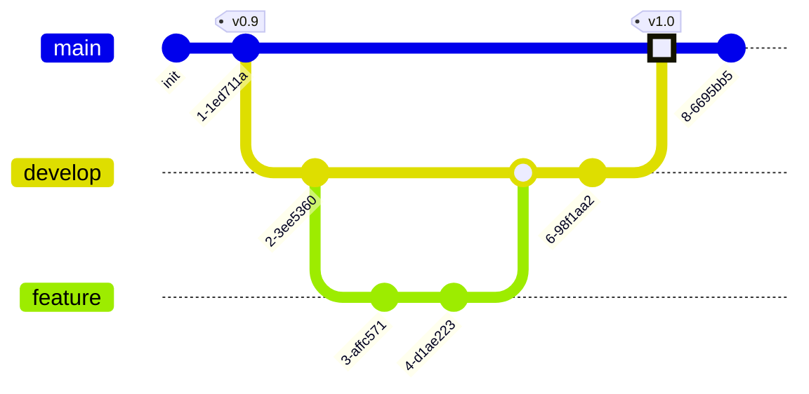

### xychart

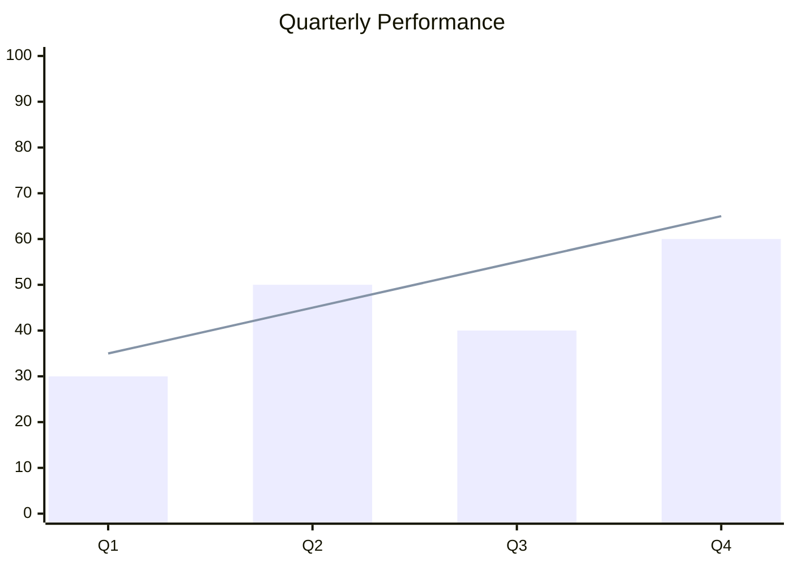

The `horizontal` orientation swaps the axes:

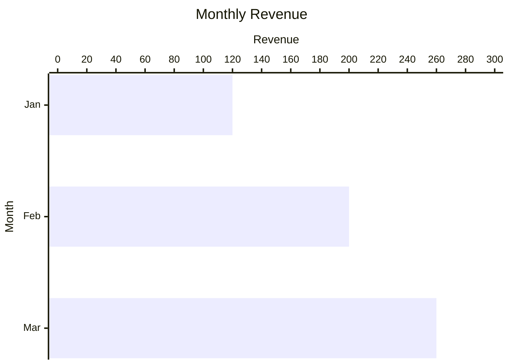

## Horizontal Rule

---

## Closing Line

End of sample.

[reference]: https://example.com/reference "Reference Title"
