# Markdownプレビューサンプル

このファイルは中立的な Markdown の例をまとめたものです。

## 見出しレベル

# 見出しレベル 1

## 見出しレベル 2

### 見出しレベル 3

#### 見出しレベル 4

##### 見出しレベル 5

###### 見出しレベル 6

## 段落とインライン装飾

この段落には**太字**、_斜体_、**_太字と斜体の組み合わせ_**、~~取り消し線~~、`インラインコード`が含まれています。
さらに Fish &amp; Chips、tea &lt; coffee のような HTML エンティティと、\*アスタリスク\* や \_アンダースコア\_ のようなエスケープ例も入れています。

この行はハードブレークで終わります。  
この行はその直下に表示されます。

この行はバックスラッシュで終わり\
次の行へ続きます。

## リンクと画像

[インラインリンク](https://example.com)

[タイトル付きリンク](https://example.com/title "Example Title")

[参照リンク][reference]

<https://example.com/help>

https://example.com/status?view=full


## 引用

> 引用行 1
> 引用行 2
>
> > ネストした引用 1
> > ネストした引用 2
>
> - 引用内リスト 1
> - 引用内リスト 2

## リスト

### 順不同リスト

- 項目 1
- 項目 2
  - ネスト項目 2.1
  - ネスト項目 2.2
    - ネスト項目 2.2.1
- 項目 3
  継続行

### 順序付きリスト

1. 項目 1
2. 項目 2
   1. ネスト項目 2.1
   2. ネスト項目 2.2
3. 項目 3

1) 別マーカー 1
2) 別マーカー 2

### タスクリスト

- [x] 完了したタスク
- [ ] 未完了のタスク
  - [x] ネストした完了タスク
  - [ ] ネストした未完了タスク

1. [x] 順序付き完了タスク
2. [ ] 順序付き未完了タスク

- 引用子要素を持つ項目
  > リスト項目内のネストした引用
- コードフェンス子要素を持つ項目
  ```bash
  printf 'sample\n'
  ```

## 表

| 列     | 中央 |          右 |
| :----- | :--: | ----------: |
| 値 A   |  1   |       alpha |
| 値 B   |  2   |        beta |
| 日本語 |  3   | mixed ASCII |

## コードフェンス

```zig
const std = @import("std");

fn sum(values: []const i32) i32 {
    var total: i32 = 0;
    for (values) |value| total += value;
    return total;
}

pub fn main() void {
    const values = [_]i32{ 1, 2, 3, 4 };
    std.debug.print("sum={}\n", .{sum(&values)});
}
```

```c
#include <stdio.h>

static int sum(const int *values, int len) {
    int total = 0;
    for (int i = 0; i < len; ++i) {
        total += values[i];
    }
    return total;
}

int main(void) {
    int values[] = {1, 2, 3, 4};
    printf("sum=%d\n", sum(values, 4));
    return 0;
}
```

```rust
fn sum(values: &[i32]) -> i32 {
    values.iter().copied().sum()
}

fn main() {
    let values = [1, 2, 3, 4];
    println!("sum={}", sum(&values));
}
```

```go
package main

import "fmt"

func sum(values []int) int {
	total := 0
	for _, value := range values {
		total += value
	}
	return total
}

func main() {
	values := []int{1, 2, 3, 4}
	fmt.Printf("sum=%d\n", sum(values))
}
```

```json
{
  "name": "example",
  "enabled": true,
  "items": [
    { "id": 1, "label": "alpha" },
    { "id": 2, "label": "beta" }
  ],
  "meta": {
    "count": 2,
    "tag": "sample"
  }
}
```

```bash
set -eu

input="sample.md"

if [ -f "$input" ]; then
  mp "$input"
else
  printf 'missing: %s\n' "$input"
fi
```

```
プレーンテキストのフェンス
2 行目には | や * のような記号があります。
3 行目はインデント付きです。
    plain text stays as-is.
```

## Mermaid 図

以下の Mermaid 図は ASCII アートとしてその場で描画されます。

### フローチャート (flowchart)

#### 基本 (TD 方向)

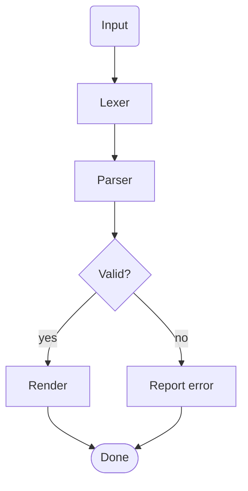

#### 基本 (LR 方向)

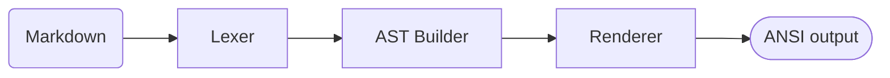

#### ネストした subgraph

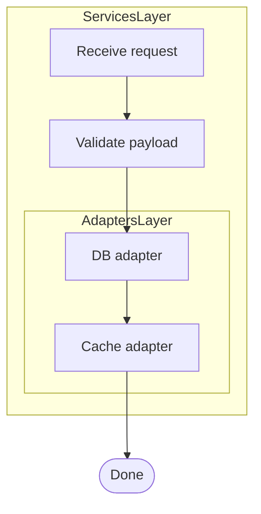

### シーケンス図 (sequenceDiagram)

#### 基本

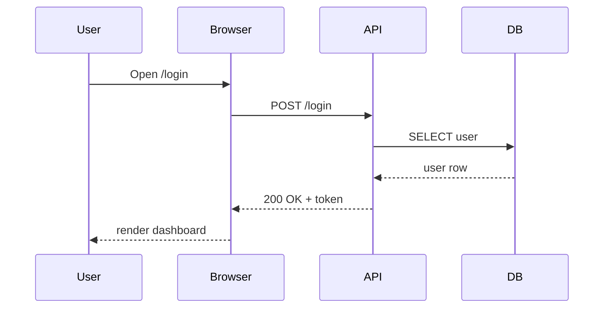

#### `alt` / `else` / `par` と note

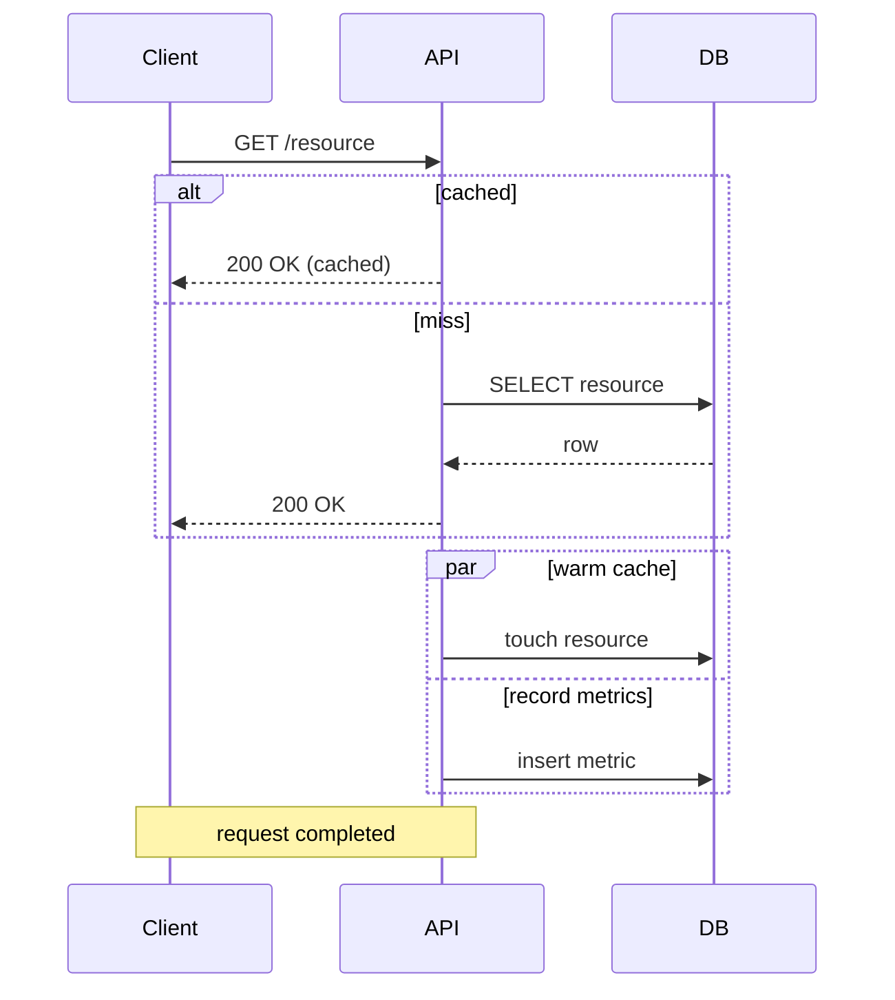

### クラス図 (classDiagram)

#### 基本

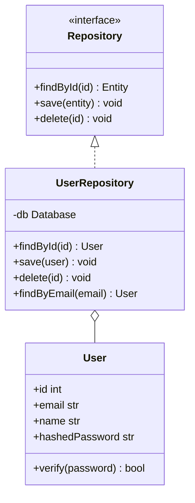

#### namespace・annotation・static/abstract メンバー

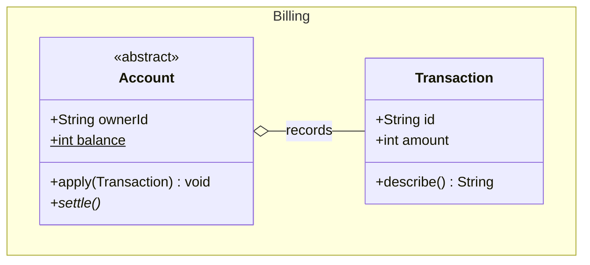

### 状態遷移図 (stateDiagram)

#### 基本

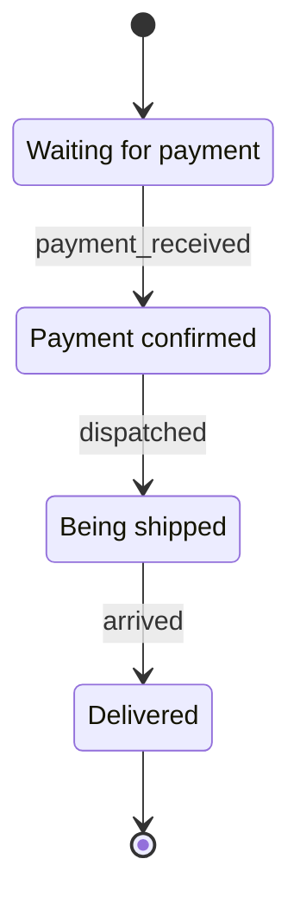

#### 複合状態 (composite state)

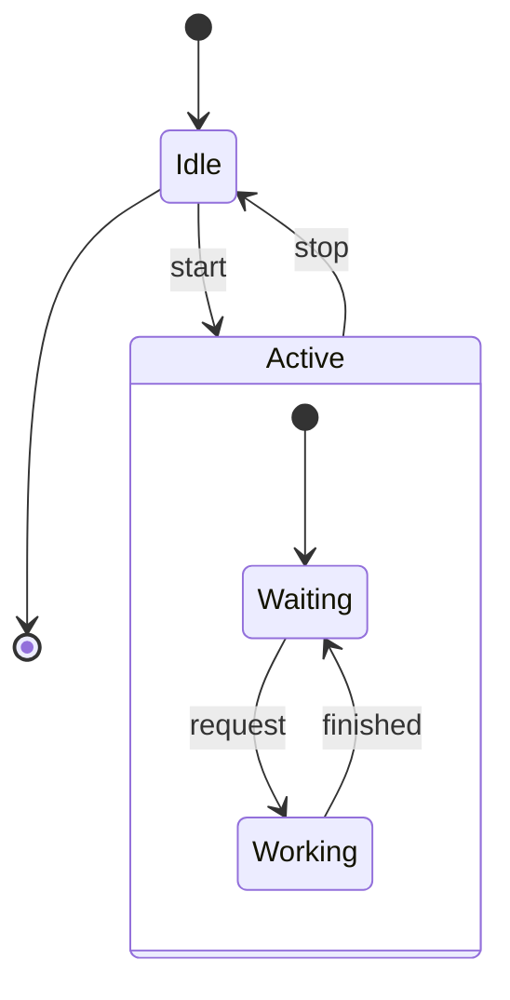

### ER 図 (erDiagram)

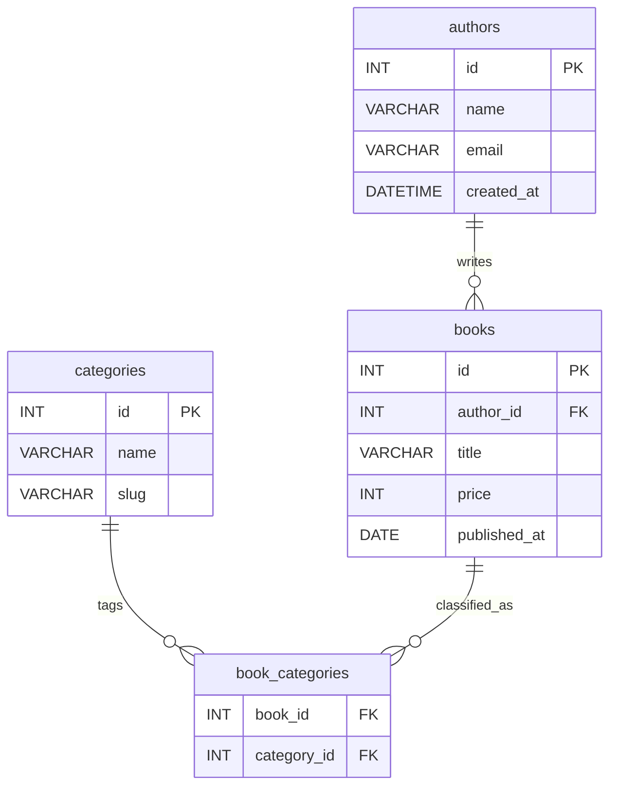

### gitGraph

ターミナルがカラー対応していれば、branch ごとに色分けされて表示されます。

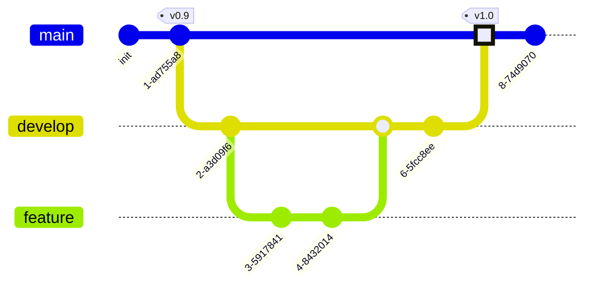

### XY チャート (xychart)

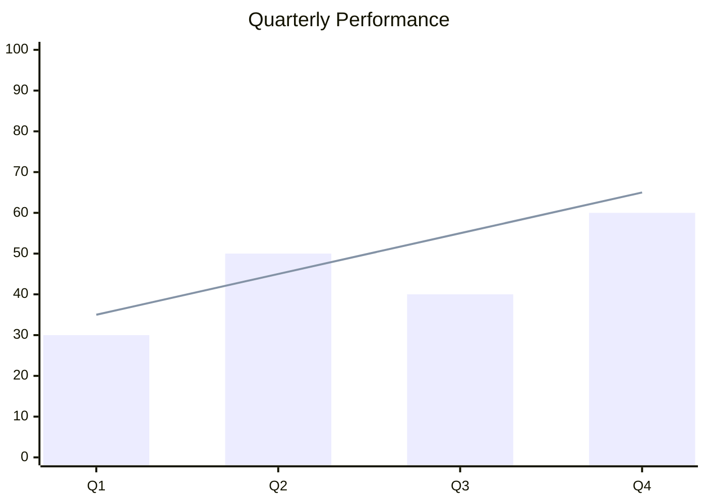

`horizontal` を付けると軸を入れ替えた横向きレンダリングになります。

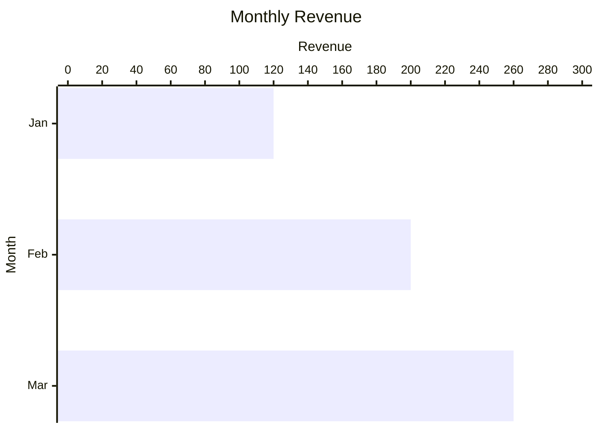

## 水平線

---

## 終了行

サンプルはここで終わりです。

[reference]: https://example.com/reference "Reference Title"
