# Markdownプレビューサンプル

このファイルは中立的な Markdown の例をまとめたものです。

## 見出しレベル

# 見出しレベル 1

## 見出しレベル 2

### 見出しレベル 3

#### 見出しレベル 4

##### 見出しレベル 5

###### 見出しレベル 6

## 段落とインライン装飾

この段落には**太字**、_斜体_、**_太字と斜体の組み合わせ_**、~~取り消し線~~、`インラインコード`が含まれています。
さらに Fish &amp; Chips、tea &lt; coffee のような HTML エンティティと、\*アスタリスク\* や \_アンダースコア\_ のようなエスケープ例も入れています。

この行はハードブレークで終わります。  
この行はその直下に表示されます。

この行はバックスラッシュで終わり\
次の行へ続きます。

## リンクと画像

[インラインリンク](https://example.com)

[タイトル付きリンク](https://example.com/title "Example Title")

[参照リンク][reference]

<https://example.com/help>

https://example.com/status?view=full


## 引用

> 引用行 1
> 引用行 2
>
> > ネストした引用 1
> > ネストした引用 2
>
> - 引用内リスト 1
> - 引用内リスト 2

## アラート

> [!NOTE]
> 読み飛ばしていても知っておいてほしい補足情報です。

> [!TIP]
> よりうまく、より簡単に進めるためのヒントです。

> [!IMPORTANT]
> 目的を達成するために必ず知っておくべき情報です。

> [!WARNING]
> 問題を避けるためにすぐ注意を向けてほしい情報です。

> [!CAUTION]
> ある操作のリスクや望ましくない結果についての注意です。

## リスト

### 順不同リスト

- 項目 1
- 項目 2
  - ネスト項目 2.1
  - ネスト項目 2.2
    - ネスト項目 2.2.1
- 項目 3
  継続行

### 順序付きリスト

1. 項目 1
2. 項目 2
   1. ネスト項目 2.1
   2. ネスト項目 2.2
3. 項目 3

1) 別マーカー 1
2) 別マーカー 2

### タスクリスト

- [x] 完了したタスク
- [ ] 未完了のタスク
  - [x] ネストした完了タスク
  - [ ] ネストした未完了タスク

1. [x] 順序付き完了タスク
2. [ ] 順序付き未完了タスク

- 引用子要素を持つ項目
  > リスト項目内のネストした引用
- コードフェンス子要素を持つ項目
  ```bash
  printf 'sample\n'
  ```

## 表

| 列     | 中央 |          右 |
| :----- | :--: | ----------: |
| 値 A   |  1   |       alpha |
| 値 B   |  2   |        beta |
| 日本語 |  3   | mixed ASCII |

## コードフェンス

```zig
const std = @import("std");

fn sum(values: []const i32) i32 {
    var total: i32 = 0;
    for (values) |value| total += value;
    return total;
}

pub fn main() void {
    const values = [_]i32{ 1, 2, 3, 4 };
    std.debug.print("sum={}\n", .{sum(&values)});
}
```

```c
#include <stdio.h>

static int sum(const int *values, int len) {
    int total = 0;
    for (int i = 0; i < len; ++i) {
        total += values[i];
    }
    return total;
}

int main(void) {
    int values[] = {1, 2, 3, 4};
    printf("sum=%d\n", sum(values, 4));
    return 0;
}
```

```rust
fn sum(values: &[i32]) -> i32 {
    values.iter().copied().sum()
}

fn main() {
    let values = [1, 2, 3, 4];
    println!("sum={}", sum(&values));
}
```

```go
package main

import "fmt"

func sum(values []int) int {
	total := 0
	for _, value := range values {
		total += value
	}
	return total
}

func main() {
	values := []int{1, 2, 3, 4}
	fmt.Printf("sum=%d\n", sum(values))
}
```

```json
{
  "name": "example",
  "enabled": true,
  "items": [
    { "id": 1, "label": "alpha" },
    { "id": 2, "label": "beta" }
  ],
  "meta": {
    "count": 2,
    "tag": "sample"
  }
}
```

```bash
set -eu

input="sample.md"

if [ -f "$input" ]; then
  mp "$input"
else
  printf 'missing: %s\n' "$input"
fi
```

```
プレーンテキストのフェンス
2 行目には | や * のような記号があります。
3 行目はインデント付きです。
    plain text stays as-is.
```

## HTML ブロック

<div class="note">
  <p>HTML ブロックはそのまま表示され、折り返されません。</p>
</div>

## Mermaid 図

### フローチャート (flowchart)

#### 基本 (TD 方向)

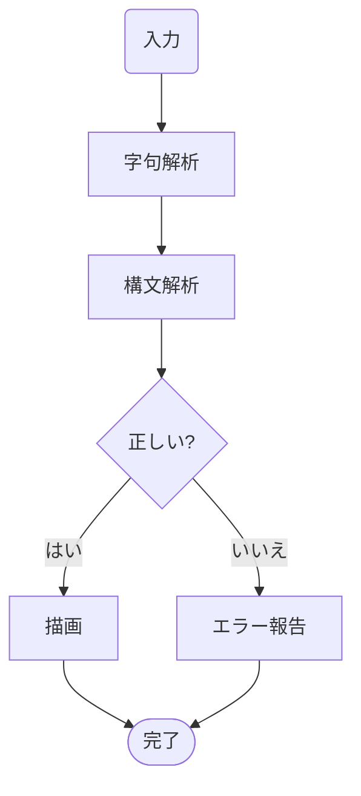
```mermaid
flowchart TD
    A(入力) --> B[字句解析]
    B --> C[構文解析]
    C --> D{正しい?}
    D -->|はい| E[描画]
    D -->|いいえ| F[エラー報告]
    E --> G([完了])
    F --> G
```

#### 基本 (LR 方向)

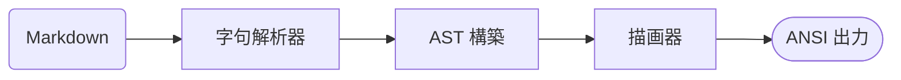
```mermaid
flowchart LR
    Src(Markdown) --> Lex[字句解析器]
    Lex --> AST[AST 構築]
    AST --> Render[描画器]
    Render --> Out([ANSI 出力])
```

#### BT 方向と RL 方向

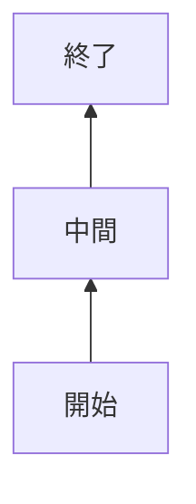
```mermaid
flowchart BT
    A[開始] --> B[中間] --> C[終了]
```

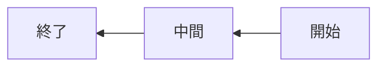
```mermaid
flowchart RL
    A[開始] --> B[中間] --> C[終了]
```

#### 括弧で書くノード形状

```mermaid
flowchart TD
    A[四角形] --> B(角丸) --> C([スタジアム]) --> D[[サブルーチン]]
    D --> E[(円柱)] --> F((円)) --> G>非対称] --> H{ひし形}
    I{{六角形}} --> J[/平行四辺形/] --> K[\逆平行四辺形\]
    K --> L[/台形\] --> M[\逆台形/] --> N(((二重円))) --> O(-楕円-)
```

#### `@{ shape }` で書くノード形状

```mermaid
flowchart TD
    A@{ shape: notch-rect, label: "カード" } --> B@{ shape: doc, label: "文書" }
    B --> C@{ shape: docs, label: "複数の文書" } --> D@{ shape: folder, label: "フォルダ" }
    E@{ shape: sl-rect, label: "手入力" } --> F@{ shape: delay, label: "遅延" }
    F --> G@{ shape: h-cyl, label: "直接アクセス" } --> H@{ shape: lin-cyl, label: "ディスク" }
    I@{ shape: tri, label: "抽出" } --> J@{ shape: hourglass, label: "照合" }
    J --> K@{ shape: cloud, label: "クラウド" } --> L@{ shape: person, label: "利用者" }
    M@{ shape: sm-circ } --> N@{ shape: text, label: "テキスト" } --> O@{ shape: fr-circ }
    P@{ shape: fork } --> Q@{ shape: brace, label: "コメント" } --> R@{ shape: cross-circ }
```

```mermaid
flowchart LR
    A@{
        shape: 'bang',
        label: "複数行の @{ } と 'クォート' と \"エスケープ\""
    } --> B@{ shape: bolt, label: "通信リンク" }
```

#### リンクの種類

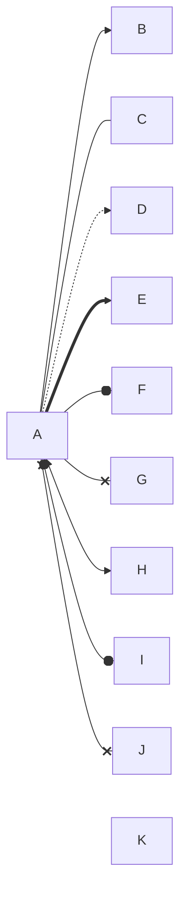
```mermaid
flowchart LR
    A --> B
    A --- C
    A -.-> D
    A ==> E
    A --o F
    A --x G
    A <--> H
    A o--o I
    A x--x J
    A ~~~ K
```

#### エッジラベル

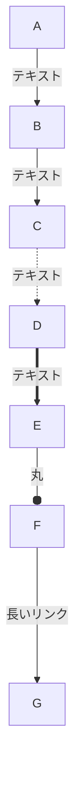
```mermaid
flowchart TD
    A -- テキスト --> B
    B -->|テキスト| C
    C -. テキスト .-> D
    D == テキスト ==> E
    E --o|丸| F
    F ---->|長いリンク| G
```

#### `&` によるグループ、自己ループ、エッジ id

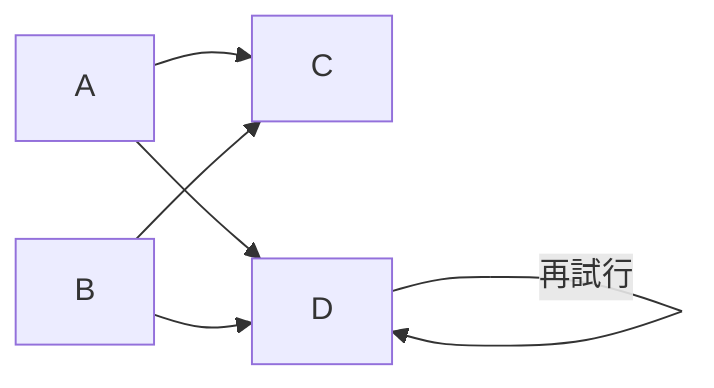
```mermaid
flowchart LR
    A & B --> C & D
    D -->|再試行| D
```

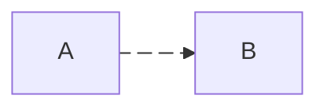
```mermaid
flowchart LR
    A e1@--> B
    e1@{ animate: true }
```

#### subgraph

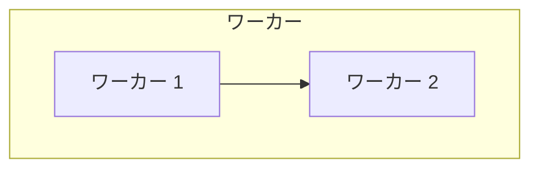
```mermaid
flowchart TD
    subgraph workers [ワーカー]
        direction LR
        W1[ワーカー 1] --> W2[ワーカー 2]
    end
```

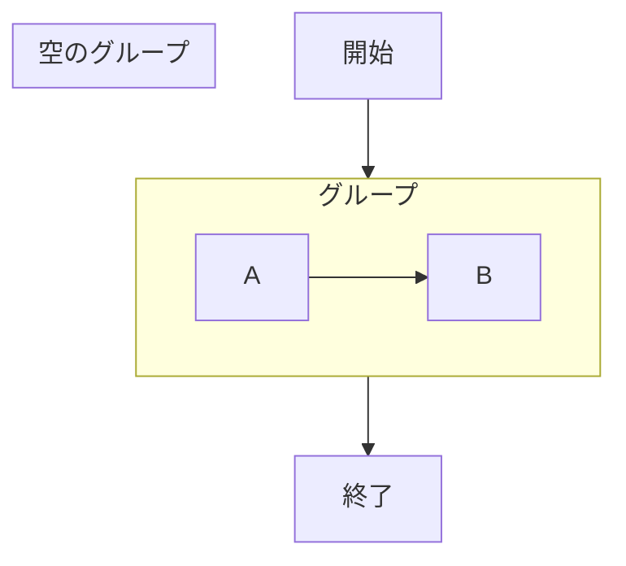
```mermaid
flowchart TD
    Start[開始] --> group
    subgraph group [グループ]
        A --> B
    end
    group --> Finish[終了]
    subgraph empty [空のグループ]
    end
```

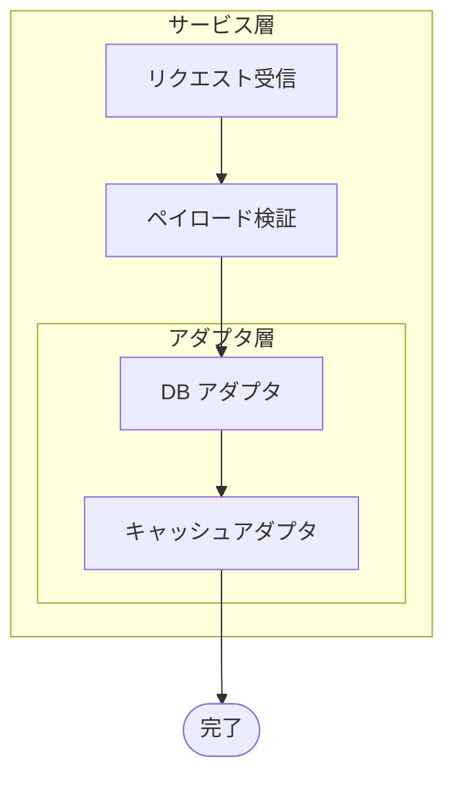
```mermaid
flowchart TD
    subgraph services [サービス層]
        Svc1[リクエスト受信] --> Svc2[ペイロード検証]
        subgraph adapters [アダプタ層]
            A1[DB アダプタ] --> A2[キャッシュアダプタ]
        end
        Svc2 --> A1
    end
    A2 --> Out([完了])
```

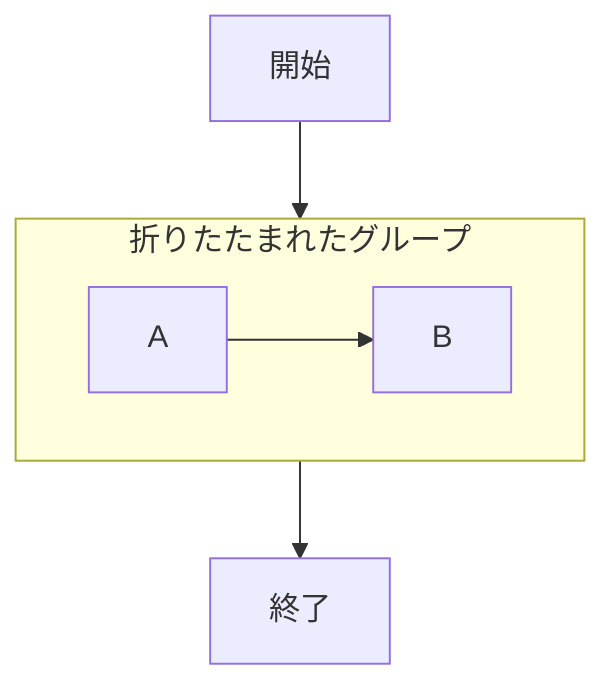
```mermaid
flowchart TD
    Start[開始] --> one
    subgraph one [折りたたまれたグループ]
        A --> B
    end
    one --> Finish[終了]
    one@{ view: collapsed }
```

#### ラベル

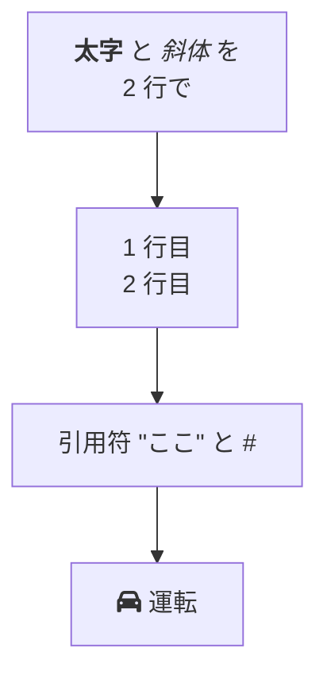
```mermaid
flowchart TD
    A["`**太字** と *斜体* を
    2 行で`"] --> B["1 行目<br>2 行目"]
    B --> C["引用符 #quot;ここ#quot; と #35;"] --> D["fa:fa-car 運転"]
```

#### frontmatter・directive・アクセシビリティ文

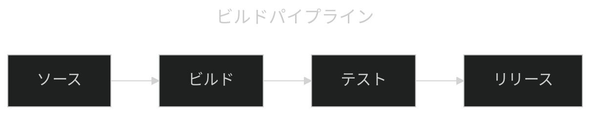
```mermaid
---
title: ビルドパイプライン
---
%%{init: { "theme": "dark" } }%%
flowchart LR
    accTitle: ビルドパイプライン
    accDescr: ソースはビルドとテストを経てリリースされる。
    Src[ソース] --> Build[ビルド] --> Test[テスト] --> Release[リリース]
```

#### スタイル

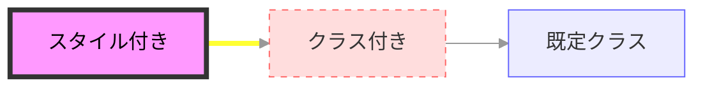
```mermaid
flowchart LR
    A[スタイル付き] --> B[クラス付き]:::warn --> C[既定クラス]
    style A fill:#f9f,stroke:#333,stroke-width:4px,color:#000
    classDef warn fill:#fdd,stroke:#f66,stroke-dasharray: 5 5
    classDef default stroke:#66f
    linkStyle 0 stroke:#ff3,stroke-width:4px
    linkStyle default stroke:#999
```

#### 構文エラー

```mermaid
flowchart LR
    A[閉じていない --> B
```

以下の図の種類はまだ対応しておらず、通常のコードブロックとして表示されます。

### シーケンス図 (sequenceDiagram)

#### 基本

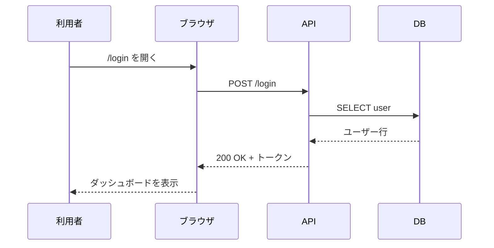
```mermaid
sequenceDiagram
    participant U as 利用者
    participant B as ブラウザ
    participant API
    participant DB

    U->>B: /login を開く
    B->>API: POST /login
    API->>DB: SELECT user
    DB-->>API: ユーザー行
    API-->>B: 200 OK + トークン
    B-->>U: ダッシュボードを表示
```

#### `alt` / `else` / `par` と note

```mermaid
sequenceDiagram
    participant Client as クライアント
    participant API
    participant DB
    Client->>API: GET /resource
    alt キャッシュあり
        API-->>Client: 200 OK (キャッシュ)
    else キャッシュなし
        API->>DB: SELECT resource
        DB-->>API: 行
        API-->>Client: 200 OK
    end
    par キャッシュ更新
        API->>DB: touch resource
    and メトリクス記録
        API->>DB: insert metric
    end
    Note over Client,API: リクエスト完了
```

### クラス図 (classDiagram)

#### 基本

```mermaid
classDiagram
    class Repository {
        <<interface>>
        +findById(id) Entity
        +save(entity) void
        +delete(id) void
    }
    class UserRepository {
        -db Database
        +findById(id) User
        +save(user) void
        +delete(id) void
        +findByEmail(email) User
    }
    class User {
        +id int
        +email str
        +name str
        +hashedPassword str
        +verify(password) bool
    }
    Repository <|.. UserRepository
    UserRepository o-- User
```

#### namespace・annotation・static/abstract メンバー

```mermaid
classDiagram
    namespace Billing {
        class Account {
            <<abstract>>
            +String ownerId
            +int balance$
            +apply(Transaction) void
            +settle()*
        }
        class Transaction {
            +String id
            +int amount
            +describe() String
        }
    }
    Account o-- Transaction : 記録する
```

### 状態遷移図 (stateDiagram)

#### 基本

```mermaid
stateDiagram-v2
    state "支払い待ち" as Pending
    state "支払い確認済み" as Confirmed
    state "配送中" as Shipped
    state "配達済み" as Delivered

    [*] --> Pending
    Pending --> Confirmed : 入金
    Confirmed --> Shipped : 発送
    Shipped --> Delivered : 到着
    Delivered --> [*]
```

#### 複合状態 (composite state)

```mermaid
stateDiagram-v2
    state "待機" as Idle
    state "稼働中" as Active {
        state "待ち" as Waiting
        state "処理中" as Working
        [*] --> Waiting
        Waiting --> Working : 要求
        Working --> Waiting : 完了
    }
    [*] --> Idle
    Idle --> Active : 開始
    Active --> Idle : 停止
    Idle --> [*]
```

### ER 図 (erDiagram)

```mermaid
erDiagram
    authors ||--o{ books : "執筆する"
    categories ||--o{ book_categories : "分類する"
    books ||--o{ book_categories : "分類される"

    authors {
        INT id PK
        VARCHAR name
        VARCHAR email
        DATETIME created_at
    }
    books {
        INT id PK
        INT author_id FK
        VARCHAR title
        INT price
        DATE published_at
    }
    categories {
        INT id PK
        VARCHAR name
        VARCHAR slug
    }
    book_categories {
        INT book_id FK
        INT category_id FK
    }
```

### gitGraph

```mermaid
gitGraph
    commit id: "初期化"
    commit tag: "v0.9"
    branch develop
    commit
    branch feature
    commit
    commit
    checkout develop
    merge feature
    commit
    checkout main
    merge develop tag: "v1.0" type: HIGHLIGHT
    commit
```

### XY チャート (xychart)

```mermaid
xychart
title "四半期の業績"
x-axis ["第1四半期", "第2四半期", "第3四半期", "第4四半期"]
y-axis 0 --> 100
bar [30, 50, 40, 60]
line [35, 45, 55, 65]
```

`horizontal` を付けると軸を入れ替えた横向きレンダリングになります。

```mermaid
xychart horizontal
title "月間売上"
x-axis "月" ["1月", "2月", "3月"]
y-axis "売上" 0 --> 300
bar [120, 200, 260]
```

## 水平線

---

## 終了行

サンプルはここで終わりです。

[reference]: https://example.com/reference "Reference Title"
